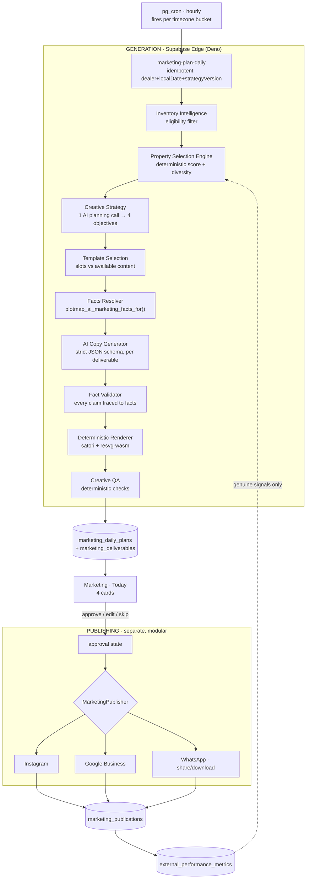

# MAPCO AI Marketing Automation — Production Architecture

**Status:** proposal, awaiting approval. Nothing in this document has been implemented.
**Date:** 2026-08-15
**Author:** architecture pass over the current `feat/mapco-v2-backend` tree.

---

## 0. The product in one line

> A dealer opens MAPCO in the morning and four finished, factually-correct marketing creatives for their own inventory are already waiting.

Not a prompt box. Not a template picker. Not an AI tool. The dealer's only decisions are **approve, tweak, skip, publish**.

---

## 1. Headline finding: much of this already exists

This was the most important result of the inspection. **A well-designed marketing domain foundation is already in the repo and was uncommitted until this session.** Architecting from scratch would have been a serious duplication.

### Already built and directly reusable

| Asset | Where | What it gives us |
|---|---|---|
| `marketing_content_contexts` | `supabase/migrations/20260812000400_marketing_foundation.sql:34` | Frozen, **versioned** marketing-safe facts + photo refs per property, with `content_hash` for change detection. Solves "a creative published last week must stay explainable after the property changes". |
| `marketing_creatives` | same:66 | `design_key`/`design_version`, channel, format, full status lifecycle (`draft→rendering→ready→approved→published/failed`), **structured** `copy` jsonb, `asset` storage ref, FK to `ai_executions`/`ai_jobs`. |
| `marketing_schedule_items` | same:105 | `slot_key` with **unique index on (dealer_id, channel, slot_key)** — idempotent daily rotation, cannot double-book. Approval is stored state. |
| `marketing_publications` | same:129 | Append-only publish-attempt log with `external_ref`, `external_url`, error code/message. |
| `marketing_channel_accounts` | same:148 | Provider-neutral. Holds `credential_ref` — the **name** of a secret, never the secret — with a regex constraint as structural defence. |
| `external_performance_metrics` | same:181 | Provider-neutral inbound metrics, flat `name→number` map, idempotent re-ingest. |
| **`plotmap_ai_marketing_facts_for()`** | same:270 | **The anti-hallucination grounding source.** Allow-listed projection; refuses `sold` and `not published`; returns property facts + dealer brand + an explicit `excluded` list. |
| `ai_executions` | `20260812000100_ai_core_foundation.sql:117` | `input_tokens`, `output_tokens`, `cost_micro_usd`, `latency_ms`, `prompt_version`, and **`context_digest`** (sha256) — the reuse/caching key. Cost control already modelled. |
| `dealer_settings` | `20260801000100_saas_foundation_scaffold.sql:92` | `brand_name`, `brand_tagline`, **`logo_url`**, `accent_color`, `support_phone`, `whatsapp_number`, `photo_bucket`, `photo_folder`. Full dealer branding source. |
| AI provider abstraction | `supabase/functions/_shared/ai/provider.ts`, `router.ts`, `service.ts` | Provider/model separated from task identity — reroutable without touching product logic. |

**Consequence:** the user-specified tables `marketing_ai_usage` and `marketing_channel_connections` are already served by `ai_executions` and `marketing_channel_accounts`. Do not create them.

### Also already built (found by deep inspection)

- **A real job substrate.** `ai_jobs` has idempotency keys, priorities, cooperative leases, retries and `FOR UPDATE SKIP LOCKED` claiming, consumed by a scheduler-agnostic Deno worker `ai-worker` with `schedule | jobs | actions` modes. **Nothing in the repo ever calls it.** The queue is built; only the trigger is missing.
- **Marketing AI tasks already exist in the catalog** — `supabase/functions/_shared/ai/tasks.ts`: `marketing_copy` (cheap class, 900 tok, temp 0.6, prompt `copy-1`, **reuse window 14 days**) and `marketing_suggestion` (standard, 1200 tok, prompt `marketing-1`, reuse 7 days). The cost-class router, in-place failover and env-overridable routes are done.
- **Three independent validation layers** already: strict JSON-Schema at generation, MAPCO's own zero-dependency validator before storage, and a render-side guard.
- **Quota enforcement**: per-call cost in integer micro-USD → transactional rollup into `ai_usage_daily`, with a pre-flight quota gate.
- `AiJobType` already includes `marketing_content_context`, and `AiRepository.marketingSuggestion(propertyId)` already exists.

### ⚠️ The precise gap — it is write paths, not tables

> `marketing_foundation.sql` has RLS enabled on all six tables with **SELECT-only policies. There is not a single INSERT/UPDATE/DELETE policy in the file.** All writes must go through `SECURITY DEFINER` RPCs — and only **two** exist (`plotmap_ai_store_marketing_context`, `plotmap_ai_ingest_external_metrics`).
>
> **The creative → schedule → publication → channel-account half of the pipeline has no write path at all.** No executor is registered for a marketing job, and `plotmap_ai_propose_action` has zero callers.

So the schema is a well-designed, entirely **inert** skeleton. Phase 1 is mostly about giving it arms and legs — RPCs, an executor, a renderer and a trigger — not about designing tables.

### What is genuinely missing

| Needed | Why the existing model doesn't cover it |
|---|---|
| `marketing_templates` + `marketing_template_versions` | `marketing_creatives.design_key` is a bare string. There is **no template registry and no slot geometry** anywhere. |
| `marketing_settings` | No per-dealer automation config: on/off, timezone, daily count, channel mix, review-vs-auto. |
| `marketing_daily_plans` | `schedule_items` has a `slot_key` but no **plan** entity grouping the day's four deliverables, and no `strategyVersion`. |
| `marketing_property_history` | Repetition memory is *derivable* from `marketing_creatives`, but an explicit projection makes the selection query cheap and the rotation rules testable. |
| Deliverable-level intent | No `objective`, `creative_type`, or `selected_photo_ids`. Needed so the four daily posts are deliberately different. |
| Scheduler | **No cron exists.** `pg_cron` appears only in a draft comment (`20260801001100_dealer360_analytics_draft.sql:953`). |
| Renderer | **No server-side image rendering capability of any kind exists.** |

---

## 2. The approved templates — what they actually are

`templates/` contains **6 production PNGs, all 1122×1402** (4:5 portrait — Instagram feed / WhatsApp status).

I measured them rather than guessing, by decoding the PNGs and finding the authored near-uniform fill zones.

**Shared slot vocabulary** across five of the six:

```
heroPhoto · location · details · highlights · contact · poweredByMapco
```

The sixth (`a54946c8`, the terracotta arch) is a different archetype: **hero-dominant**, one headline card, no labelled field rows.

Measured geometry, normalised (fraction of 1122×1402) — two templates segmented cleanly and are ready to register as-is:

**`c5418ac4` — Sage / marble / gold**
| slot | px | normalised |
|---|---|---|
| heroPhoto | 1008×554 @ (60,198) | 5.3%, 14.1%, 89.8%×39.5% |
| location | 367×57 @ (175,839) | 15.6%, 59.8%, 32.7%×4.1% |
| details | 368×57 @ (681,839) | 60.7%, 59.8%, 32.8%×4.1% |
| highlights | 877×125 @ (171,994) | 15.2%, 70.9%, 78.2%×8.9% |
| contact | 563×57 @ (175,1217) | 15.6%, 86.8%, 50.2%×4.1% |

**`1729fe26` — Organic clay**
| slot | px | normalised |
|---|---|---|
| heroPhoto | 977×577 @ (71,170) | 6.3%, 12.1%, 87.1%×41.2% |
| location | 466×67 @ (154,839) | 13.7%, 59.8%, 41.5%×4.8% |
| details | 466×68 @ (154,981) | 13.7%, 70.0%, 41.5%×4.9% |
| contact | 466×68 @ (154,1123) | 13.7%, 80.1%, 41.5%×4.9% |

**The other four could not be auto-segmented** — their fill zones are the same near-white as their background art, so colour segmentation merges them. This is an important, concrete result:

> **Template ingestion must be assisted and one-time, not automatic and not per-render.** Geometry is authored/verified once by a human against the measurement probe, stored in `marketing_template_versions`, and thereafter treated as immutable data. A vision model must never rediscover slot positions at render time.

This matches the instruction in the brief and is now backed by evidence.

### Two findings that need a product decision

1. **No dealer-logo slot exists.** Every template carries *Powered by MAPCO*, but none has a zone for the dealer's own logo — yet `dealer_settings.logo_url` exists and the brief says dealer branding is primary. Options: (a) render dealer name/phone into the existing `contact` slot and accept no dealer logo in v1; (b) commission a template v2 with a `dealerLogo` zone. **I recommend (a) for Phase 1** and a template revision for Phase 2 — it needs your design call, not mine.
2. **1122×1402 is not a standard channel size.** Instagram portrait is 1080×1350. Because slot geometry is stored **normalised**, the renderer can output any size; but the source template raster will be downscaled ~3.7%. Recommend re-exporting the six templates at 1080×1350 (or 2160×2700 for retina) at some point. Not a Phase 1 blocker.

---

## 3. System diagram



**Generation and publishing are separate systems.** A creative is a finished, valuable artefact even if no channel is ever connected — the dealer downloads it and posts manually. Phase 1 ships exactly that.

---

## 4. Module boundaries

```
v2/src/packages/marketing/          ← domain types, pure logic, no I/O
  contracts.ts                      MarketingRepository, DailyPlan, Deliverable
  types.ts                          MarketingTemplate, SlotGeometry, CreativeCopy
  selection/
    eligibility.ts                  pure: Property[] → EligibleProperty[]
    scoring.ts                      pure: signals → score (weights from config)
    diversity.ts                    pure: rotation / anti-repetition
  strategy/
    daily-mix.ts                    pure: 4 objectives from a configurable strategy
  templates/
    registry.ts                     TemplateDefinition lookup
    selection.ts                    pure: (content, objective, history) → template
  validation/
    fact-validator.ts               pure: (copy, facts) → Violation[]
    claim-rules.ts                  the allow/deny claim vocabulary
    layout-safety.ts                pure: text fitting, truncation, font stepping
  usage/
    cost.ts                         token→cost, budget guards

supabase/functions/
  marketing-plan-daily/             the scheduled entry point (idempotent)
  marketing-render/                 satori + resvg → PNG → storage
  marketing-publish/                connector dispatch (Phase 2)
  _shared/marketing/
    facts.ts                        wraps plotmap_ai_marketing_facts_for
    copy-schema.ts                  strict JSON schema for AI output
    renderer/
      compose.ts                    slot geometry → satori node tree
      fonts.ts                      TTF loading (see §7 risk)
    publishers/
      index.ts                      MarketingPublisher interface
      whatsapp.ts                   "ready to share" — no fake success

v2/src/apps/marketing/              ← the dealer UI (already scaffolded)
```

**Every `selection/`, `strategy/`, `validation/` module is a pure function.** They take data and return data — no network, no DB, no AI. That is what makes the pipeline independently testable, which the brief demands.

---

## 5. Data model additions

Only what is genuinely missing. All tenanted by `dealer_id text references dealer_settings(dealer_id)`, matching the existing RLS pattern.

```sql
-- Template registry. Geometry is authored once, then immutable data.
create table public.marketing_templates (
  id            text primary key,          -- 'sage-marble-gold'
  name          text not null,
  archetype     text not null check (archetype in ('field-card','hero-dominant')),
  status        text not null default 'active'
                check (status in ('active','retired','draft')),
  design_tags   jsonb not null default '[]'::jsonb,   -- ['warm','premium','botanical']
  created_at    timestamptz not null default now()
);

create table public.marketing_template_versions (
  id                uuid primary key default gen_random_uuid(),
  template_id       text not null references public.marketing_templates(id) on delete cascade,
  version           integer not null check (version >= 1),
  asset_bucket      text not null,
  asset_path        text not null,          -- the approved PNG
  intrinsic_w       integer not null,
  intrinsic_h       integer not null,
  aspect_ratio      text not null,          -- '4:5'
  -- Normalised slot geometry: {slot: {x,y,w,h,align,maxLines,minPt,maxPt}}
  slots             jsonb not null,
  supported_channels jsonb not null default '["generic"]'::jsonb,
  min_photos        integer not null default 1,
  max_photos        integer not null default 1,
  status            text not null default 'draft'
                    check (status in ('draft','verified','retired')),
  verified_by       uuid references public.profiles(id),
  verified_at       timestamptz,
  created_at        timestamptz not null default now(),
  unique (template_id, version)
);

-- Per-dealer automation config.
create table public.marketing_settings (
  dealer_id            text primary key references public.dealer_settings(dealer_id) on delete cascade,
  automation_enabled   boolean not null default false,   -- OFF by default
  timezone             text not null default 'Asia/Kolkata',
  generate_at_local    time not null default '07:00',
  daily_deliverables   integer not null default 4 check (daily_deliverables between 1 and 8),
  channel_mix          jsonb not null default '["generic"]'::jsonb,
  approval_mode        text not null default 'review'
                       check (approval_mode in ('review','auto')),  -- auto is opt-in, later
  strategy_version     text not null default 'v1',
  scoring_weights      jsonb not null default '{}'::jsonb,  -- override config, not code
  excluded_property_ids jsonb not null default '[]'::jsonb,
  boosted_property_ids  jsonb not null default '[]'::jsonb,
  updated_at           timestamptz not null default now()
);

-- The day's plan. Idempotency key is the unique index.
create table public.marketing_daily_plans (
  id               uuid primary key default gen_random_uuid(),
  dealer_id        text not null references public.dealer_settings(dealer_id) on delete cascade,
  local_date       date not null,
  timezone         text not null,
  strategy_version text not null,
  status           text not null default 'planning'
                   check (status in ('planning','generating','ready','partial','failed')),
  planning_execution_id uuid references public.ai_executions(id) on delete set null,
  generated_at     timestamptz,
  created_at       timestamptz not null default now()
);

-- THE idempotency guarantee: a retried scheduler cannot double-generate.
create unique index marketing_daily_plans_uidx
  on public.marketing_daily_plans (dealer_id, local_date, strategy_version);

-- One of the four. Binds plan → property → template → creative.
create table public.marketing_deliverables (
  id                 uuid primary key default gen_random_uuid(),
  dealer_id          text not null references public.dealer_settings(dealer_id) on delete cascade,
  plan_id            uuid not null references public.marketing_daily_plans(id) on delete cascade,
  slot_index         integer not null check (slot_index between 0 and 7),
  property_id        text not null,
  template_id        text not null references public.marketing_templates(id),
  template_version   integer not null,
  objective          text not null check (objective in (
                       'primary_showcase','inventory_highlight','location_advantage','alt_channel_cut')),
  channel            text not null default 'generic',
  selected_photo_ids jsonb not null default '[]'::jsonb,
  selection_reason   jsonb not null default '{}'::jsonb,  -- why THIS property today
  creative_id        uuid references public.marketing_creatives(id) on delete set null,
  status             text not null default 'planned' check (status in (
                       'planned','generating','rendering','ready_for_review','approved',
                       'scheduled','publishing','published','failed','skipped')),
  failure_reason     text,
  created_at         timestamptz not null default now(),
  updated_at         timestamptz not null default now(),
  unique (plan_id, slot_index)
);

-- No two deliverables in one plan may push the same property.
create unique index marketing_deliverables_plan_property_uidx
  on public.marketing_deliverables (plan_id, property_id);

-- Repetition memory — cheap to query during selection.
create table public.marketing_property_history (
  id             uuid primary key default gen_random_uuid(),
  dealer_id      text not null references public.dealer_settings(dealer_id) on delete cascade,
  property_id    text not null,
  marketed_on    date not null,
  template_id    text not null,
  objective      text not null,
  channel        text not null,
  copy_hash      text not null,   -- sha256(headline+features) → kills repeat wording
  render_hash    text,            -- sha256 of the rendered PNG → kills identical images
  outcome        text not null default 'generated'
                 check (outcome in ('generated','approved','published','skipped')),
  created_at     timestamptz not null default now()
);

create index marketing_property_history_recent_idx
  on public.marketing_property_history (dealer_id, property_id, marketed_on desc);
```

RLS on every table follows the existing pattern verbatim:

```sql
using (public.plotmap_is_active_member() and dealer_id = public.plotmap_current_dealer_id())
```

---

## 6. Property Selection Engine

**Deterministic first, AI second.** The score is computed in pure TypeScript from real signals; the AI never picks the property, it only explains and writes about the property that scoring chose. This makes the choice auditable and reproducible.

```
score =
    eligibility        (hard gate — not a weight)
  + freshness          days since last marketed, capped
  + dealerPriority     boosted/pinned properties
  + genuineEngagement  ONLY real measured signals (see §8)
  + contentReadiness   photo count, factual completeness
  + inventoryDiversity under-represented city/type/sector
  − recentMarketingPenalty
  − repetitionPenalty  same template / same copy hash
```

**Hard eligibility gate** — a property is ineligible if any of:
`sold` · `not published` · zero usable photos · missing minimum facts (size, city, sector) · in `excluded_property_ids` · already used in this plan.

`plotmap_ai_marketing_facts_for()` already enforces the first two server-side and returns `{ok:false, reason:'sold'|'not_published'}`. **The selection engine and the facts function must agree** — the facts call is the final authority and re-checked at QA time, because a property can sell between planning and rendering.

Weights live in `marketing_settings.scoring_weights` (JSON), defaulted from a config module. Never hard-coded in UI.

**Diversity is a constraint, not a weight.** After scoring, the four picks are chosen under rules: no repeated property (DB-enforced), prefer distinct cities, prefer distinct property types, no template used twice in one plan, no template used in the last N days for the same property.

---

## 7. The deterministic renderer — the hardest problem

### Deployment reality
- **Vercel is static-only** here (`v2/vercel.json`: `framework: vite`, `outputDirectory: dist`, no functions). No Node serverless runtime exists.
- **Supabase Edge Functions (Deno)** is the only server-side compute (`config.toml` `[edge_runtime] enabled = true`; `ai-run`, `ai-worker` already deployed).

### Recommendation: **satori + resvg-wasm inside a Supabase Edge Function**

| Approach | Verdict |
|---|---|
| **satori → SVG, resvg-wasm → PNG** | ✅ **Chosen.** Pure WASM, runs on Deno, deterministic, pixel-stable, no browser. |
| Browser canvas, upload from the tab | ❌ Violates "must not depend on a browser tab being open". |
| Puppeteer / headless Chrome | ❌ Not available on Deno Edge; heavyweight; brittle screenshot hack the brief explicitly warns against. |
| `@napi-rs/canvas` / `sharp` | ❌ Native Node addons; no Node runtime deployed. Would require standing up a new service. |

**Composition model:** the approved template PNG is the background layer, embedded as a data URI; the property photo is composited into the `heroPhoto` slot with cover-fit; text is laid out into the measured slot boxes. Because slot geometry is normalised, one definition renders 1080×1350, 1080×1080 or 1080×1920 without redesign.

### Three risks I want to flag now, not later

1. **🔴 Fonts are woff2 — satori cannot read them.** `v2/public/fonts/` ships only `.woff2`. Satori requires TTF/OTF/WOFF. We must obtain TTF cuts of Hanken Grotesk and Newsreader for the render path. *This is a hard blocker for the renderer and needs licence-checking, not just a download.*
2. **🟠 Edge Function memory.** Templates are 1.1–2.6 MB PNGs; decoded that is ~6.3 MB raw each, plus the property photo, plus the rasterised output. Feasible within typical Edge limits but must be measured. Mitigation: pre-optimise the six templates (they are far larger than necessary), and render one deliverable per invocation rather than four.
3. **🟠 Cold-start + WASM init** on every render. Mitigation: render the four deliverables in one invocation *after* measuring memory, or keep a warm worker.

### Layout safety (non-negotiable)
Per slot the registry stores `maxLines`, `minPt`, `maxPt`, `align`, `overflow`. The pipeline: measure → step font size down within `[minPt,maxPt]` → if still overflowing, drop the lowest-priority feature → if still overflowing, **fall back to a template with a larger slot**. Text must never overflow the approved design; the fallback is a template change, not a clipped word.

---

## 8. Anti-hallucination — and an uncomfortable honesty check

Every factual token rendered must be traceable to `plotmap_ai_marketing_facts_for()`. That function is already an allow-list, already refuses sold/unpublished stock, and already declares its `excluded` fields.

**Allowed** (only when present in the facts payload): size, city, area, sector, facing, position, approvals, landmark name + stored distance, dealer brand/phone/whatsapp.

**Denied unconditionally** — the validator rejects the deliverable, it does not "fix" it:
`best investment` · `guaranteed appreciation` · `high rental yield` · `upcoming metro/airport/highway` · `most demanded sector` · `limited time` · `price rising` · any number not present in facts · any amenity not in facts · any distance not stored.

Implementation: a claim-extraction pass over the structured copy fields, matched against a rules table, **plus** a numeric-token sweep — every digit string in the output must appear in the facts payload or be a validator-approved derivation. Deterministic. The AI is never the only QA.

### Which engagement signals are actually real — now verified

Deep inspection settled this precisely. **Exactly one engagement pipeline is genuinely instrumented end-to-end.**

| Signal | Real? | Evidence |
|---|---|---|
| **Client-link events** — `opened`, `audio_played`, `call_clicked`, `whatsapp_clicked`, `visit_requested` | ✅ **REAL** | Written by the buyer page, persisted to `client_link_events`, counted server-side in SQL. |
| `Property.views` | ❌ Fixture | **Never incremented anywhere in the codebase.** Mock shows 34/21/18…; every real create writes `0`. |
| Presentation events | ❌ Empty | `PresentationEventsRepository.record` has **zero callers**; `presentation_events` is an empty table. |
| `DemandSignals` | ❌ Fixture | Derived from that empty table in Supabase; returns hardcoded 83/51/29/14/9/6 in mock. |
| `Client.viewed` | ❌ Fixture | Fixture-only. |

**Therefore the `genuineEngagement` term uses client-link events and nothing else.** A property whose private link a buyer actually opened, called from, or requested a visit on is genuinely a hotter property, and scoring on that is honest. `views`, presentation opens and demand signals are **excluded from scoring entirely** until they are instrumented — they would be invented numbers driving real spend.

This also means the dealer Home "192 opens / hottest area" figures are **not** a safe input to marketing selection today.

### Location claims

MAPCO Earth does real work — Google Places (New) discovery, a slot-driven analyst, and **29 MAPCO-owned road GeoJSON files with genuine perpendicular-distance computation**. So a road-proximity statement can be factual.

The rule stands regardless: only **stored** landmark names with **stored** distances, and road facts derived from the real GeoJSON computation, may be rendered. Anything straight-line, estimated, or Places-derived-at-render-time must not appear as a factual claim on a creative.

---

## 9. Scheduler

**Verified: there is zero scheduled execution in the repo** — no `pg_cron`, no `pg_net`, no `Deno.cron`, no Vercel `crons`, no GitHub Actions, no `[functions]` block in `config.toml`. (The one place periodic work was needed — predictive-event retention — was deliberately implemented as an AFTER-INSERT statement trigger *to avoid* needing cron.)

But the hard part is already built: `ai_jobs` (idempotency keys, priorities, cooperative leases, retries, `FOR UPDATE SKIP LOCKED`) plus the `ai-worker` Deno worker with a `schedule` mode — **which nothing currently calls.** We are adding a trigger to an existing queue, not building a queue.

Proposal:

```
pg_cron  hourly  →  select dealers whose local time == generate_at_local
                    and automation_enabled
                 →  net.http_post → marketing-plan-daily (per dealer)
```

- Timezone comes from `marketing_settings.timezone`, never the browser.
- **Idempotency is structural**: the unique index on `(dealer_id, local_date, strategy_version)` means a retried or duplicated fire is a no-op insert conflict, not a second plan.
- Per-deliverable work is resumable: a failed render leaves the deliverable `failed` with the plan `partial`; a retry regenerates only that slot.
- **Failure never destroys a generated creative.** `marketing_creatives` rows persist independently of publish outcome.

---

## 10. Publishing connectors

```ts
interface MarketingPublisher {
  readonly channel: MarketingChannel;
  canPublish(account: ChannelAccount): Promise<Result<boolean>>;
  publish(input: PublishInput): Promise<Result<PublishOutcome>>;
  status(externalRef: string): Promise<Result<PublishStatus>>;
}
```

Phase 1 ships exactly one implementation: **WhatsApp / manual share**, whose `publish()` does *not* claim success — it transitions to `ready_to_share` and hands back a download URL. **If a platform cannot actually publish, we never fake success.** That state is a first-class citizen, not an error.

Instagram and Google Business Profile require app review, business verification and long-lived token handling; each is its own project. They are Phase 2, added one at a time, behind `marketing_channel_accounts.status`.

---

## 11. Security

Inherits the existing model — no new patterns invented.

- Every new table is `dealer_id`-tenanted with the same RLS predicate.
- **No publishing credential is ever stored in a table.** `marketing_channel_accounts.credential_ref` holds the *name* of a secret in the Edge secret store, with a regex constraint making it structurally hard to put a token there. Preserve this.
- No service-role key reaches the browser. All generation runs in Edge Functions.
- **Photos are two-track — the renderer must use the canonical track.** Verified: `Property.photos: string[]` holds *display* URLs at runtime, while `photoStorage: PropertyPhotoStorageRef[]` holds the canonical **private** object paths `dealers/<dealerId>/properties/<propertyId>/<objectId>.<ext>` in a private (`public=false`) `property-photos` bucket, capped at 5 MB, `jpeg|png|webp`. A path becomes displayable only via a **signed URL**. The renderer must read `photoStorage` server-side and sign internally; it must never depend on the display track, and the raw object path must never leave the Edge Function.
- Dealer identity is never supplied by the browser: `plotmap_current_dealer_id()` resolves `profiles.dealer_id` from `auth.uid()`. Edge functions re-derive it under the **caller's** JWT rather than trusting a request body. Marketing RPCs must follow this exactly.
- A dealer can never read another dealer's templates, creatives, plans, settings, channel accounts or metrics — enforced by RLS, not by UI filtering.

---

## 12. Cost control

Existing `ai_executions` already captures tokens, `cost_micro_usd`, latency and `context_digest`.

**The rule: one planning call per dealer per day, not four.**

```
1 × planning call     → strategy for all 4 deliverables   (larger, reasoning)
0–4 × copy calls      → short, strict-schema, cheap        (skipped when reusable)
0 × AI at render time → fully deterministic
```

Reuse: `context_digest = sha256(facts + prompt_version + objective)`. Identical facts and prompt version ⇒ reuse the stored copy instead of re-calling. Since property facts change rarely, steady-state cost per dealer-day approaches **one planning call**.

Guards: per-dealer daily token ceiling; global daily spend ceiling; on breach the plan degrades to *deterministic copy from facts only* rather than failing or overspending. At 1,000 dealers this is the difference between ~1k and ~5k model calls per morning.

---

## 13. Phase 1 boundary — proposed

**In scope.** Delivers the whole product promise minus social publishing.

1. Migration: the six new tables in §5 + RLS.
2. Template ingestion: author + verify slot geometry for all 6 templates; seed the registry. (Two are measured already; four need assisted authoring.)
3. `packages/marketing/` pure domain: eligibility, scoring, diversity, strategy mix, template selection, fact validator, layout safety — **with unit tests**, no I/O.
4. Edge function `marketing-plan-daily`: idempotent plan creation, 1 planning call, per-deliverable copy with strict schema.
5. Edge function `marketing-render`: satori + resvg → PNG → private storage → `marketing_creatives.asset`.
6. Creative QA gate before `ready_for_review`.
7. Marketing UI **Today** wired to real deliverables: preview, approve, skip, regenerate, change template, download.
8. **History** tab from `marketing_property_history`.
9. `pg_cron` scheduling + manual "Generate today" trigger for testing.

**Explicitly out of scope for Phase 1.**
- Instagram / Google Business publishing (Phase 2, one at a time)
- Auto-publish mode — generation and publishing permissions stay separate; `approval_mode='auto'` ships disabled
- Real performance metrics ingestion (Phase 3)
- Engagement-weighted selection (until signals are confirmed real — §8)
- Dealer-uploaded custom templates
- Multi-language copy
- Video / carousel creatives

**Phase 1 is done when:** automation is enabled for one dealer, cron fires at 07:00 local, and by 07:05 four factually-validated, correctly-rendered creatives are waiting in Today — with no browser open and no prompt typed.

---

## 14. Risk register

| # | Risk | Sev | Mitigation |
|---|---|---|---|
| 1 | **woff2 fonts unusable by satori** | 🔴 High | Obtain licensed TTF/OTF cuts before renderer work starts. Blocks §7. Verify licence terms for server-side rasterisation. |
| 2 | **Scoring on fixture engagement data** | 🔴 High | **Resolved by inspection.** Score on `client_link_events` only — the one genuinely instrumented pipeline. `Property.views`, presentation events and DemandSignals are excluded entirely (never incremented / zero callers / hardcoded). |
| 2b | **No write path exists for creatives/schedule/publications** | 🔴 High | The six marketing tables are SELECT-only with no INSERT/UPDATE/DELETE policy and only 2 write RPCs. Phase 1 must author the missing `SECURITY DEFINER` RPCs + register a marketing executor. This is the bulk of the backend work. |
| 3 | Edge Function memory during render | 🟠 Med | Pre-optimise template PNGs; one deliverable per invocation; measure before committing to batch rendering. |
| 4 | Four slot geometries need manual authoring | 🟠 Med | Assisted authoring against the measurement probe; mark `status='draft'` until a human sets `verified`. Only `verified` versions may render. |
| 5 | AI invents a fact despite validation | 🟠 Med | Deterministic numeric-token sweep + claim rules; reject rather than repair; log every violation for prompt tuning. |
| 6 | Property sells between planning and render | 🟠 Med | Re-check `plotmap_ai_marketing_facts_for()` at QA time; a `sold` result voids the deliverable, not the plan. |
| 7 | Cost blowout at scale | 🟠 Med | One planning call/day; digest-based reuse; per-dealer and global ceilings with graceful degradation. |
| 8 | Instagram/GBP API approval delays | 🟡 Low | Phase 1 does not depend on them; WhatsApp share path is genuinely useful alone. |
| 9 | No dealer-logo slot in approved templates | 🟡 Low | Product decision needed (§2). Contact slot carries brand in v1. |
| 10 | Template raster is 1122×1402, not 1080×1350 | 🟡 Low | Normalised geometry makes output size free; re-export templates when convenient. |

---

## 15. Design reconciliation — one real conflict

The **approved** `MAPCO Marketing.dc.html` is a deliberately tiny three-tab daily post desk. Its whole state model is:

```js
state = { section, idx, libDay, toast, posts: [{ pi, status, priceHeld }] }
status ∈ ready | posted | skipped
```

**There is no approval-mode concept in the approved design.** Approval is implicit and per-post — *"Post it"* / *"Not today"*. Automatic generation is implied by the copy *"Skipped. MAPCO will bring something else."* The earlier `v1` file is a much larger five-tab product (Today, Library, Calendar, Performance, **Autopilot**) with an explicit approval-vs-auto switch — and it was **deliberately cut down** to the approved three-tab version.

Two consequences:

1. My §5 `marketing_settings.approval_mode` is a **backend** capability with no approved UI. Keep the column (it is how auto-publish stays opt-in and separable from generation), but **do not add an Autopilot tab** — that would reintroduce the design you already rejected. Automation settings stay minimal or live outside the three tabs until you say otherwise.
2. The approved **Performance** tab is currently a hardcoded dark analytics hero + leaderboard + suggestion band. Given §8, most of those numbers cannot be honestly sourced yet. Phase 1 should render Performance from **real counted outcomes only** (generated / approved / skipped / published, plus client-link events), not the hardcoded figures.

---

## 16. What I need from you before implementing

1. **Approve or amend the Phase 1 boundary** (§13).
2. **Dealer logo** (§2): ship v1 without a logo zone, or revise templates first?
3. **Fonts** (§14 #1): can you supply licensed TTF/OTF for Hanken Grotesk + Newsreader, or should the renderer use a different licensed family?
4. ~~Engagement signals~~ — **answered by inspection.** Client-link events are real and will drive the engagement term; views/presentation/demand are excluded. Flag only if you disagree.
5. **Scoring weights**: happy to start with my defaults, or do you have a view on what should drive "market this today"?
6. **Performance tab** (§15): confirm it should show only real counted outcomes in Phase 1, rather than the hardcoded analytics currently in the approved design.
